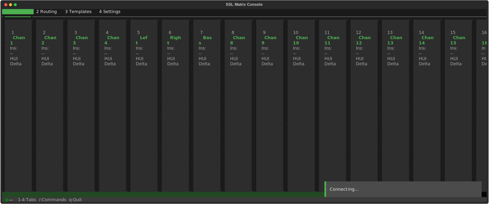

# SSL Matrix Control

**A reverse-engineered Python client for controlling SSL Matrix mixing consoles over Ethernet.**




## What is this

The SSL Matrix is a 16-channel analog mixing console with digital control capabilities -- flying faders, DAW integration, insert routing, and session recall. SSL's official control software (MatrixRemote) is a Java application that hasn't been maintained for modern macOS.

This project is a from-scratch Python replacement, reverse-engineered from the decompiled MatrixRemote source and live packet captures. It speaks the console's native UDP protocol and exposes every documented control surface feature through a terminal UI, interactive REPL, and scriptable CLI.

## Features

- **Real-time TUI dashboard** with SSL-inspired dark theme, tabbed layout, and command palette
- **Channel strip monitoring** -- names, DAW layer assignments, insert routing, automation modes
- **60+ CLI commands** covering channels, routing, profiles, projects, Total Recall, XPatch, softkeys
- **Session templates** -- save, load, diff, and apply full console state snapshots
- **Connection health monitoring** with auto-reconnect and heartbeat tracking
- **Interactive REPL** and one-shot CLI mode for scripting
- **274 unit tests** with full handler coverage
- **Minimal dependencies** -- Python stdlib + [Textual](https://github.com/Textualize/textual) for the TUI

## Quick Start

```bash
git clone https://github.com/koltyj/SSL.git
cd SSL
pip install -e ".[dev]"

# Launch the REPL
python3 -m ssl-matrix-client

# Launch the TUI
python3 -m ssl-matrix-client tui

# One-shot commands
python3 -m ssl-matrix-client channels
python3 -m ssl-matrix-client --ip 10.0.0.50 layers
python3 -m ssl-matrix-client -v status
```

The console's default IP is `192.168.1.2` on UDP port `50081`. Pass `--ip` to override.

## Terminal UI

The TUI provides a full-screen dashboard built on Textual with four tabs:

- **Channels** -- live channel strip display with names, DAW layer info, and flash highlights on state changes
- **Routing** -- insert matrix and XPatch configuration
- **Templates** -- session template management (save/load/diff)
- **Settings** -- console configuration, profiles, automation modes

Key bindings:

| Key | Action |
|-----|--------|
| `1`-`4` | Switch tabs |
| `/` | Open command palette |
| `q` | Quit |

A status bar shows connection health (green/yellow/red dot), active project, and last loaded template. A disconnect overlay appears automatically when the console goes offline.

## CLI Commands

### Connection

| Command | Description |
|---------|-------------|
| `connect` | Connect to the console and sync state |
| `disconnect` | Disconnect |
| `status` | Show console info, firmware, heartbeat age |
| `health` | Detailed connection health report |

### Channels & Profiles

| Command | Description |
|---------|-------------|
| `channels` | List all channel names |
| `rename <ch> <name>` | Rename a channel (6 char max) |
| `profiles` | List available DAW profiles |
| `layers` | Show DAW layer protocol assignments |
| `setprofile <layer> <name>` | Assign a profile to a DAW layer |
| `transportlock <0-4>` | Set transport lock to a specific layer |

### Routing & Inserts

| Command | Description |
|---------|-------------|
| `matrix` | Show insert matrix assignments |
| `assign <ch> <slot> <dev>` | Assign a device to an insert slot |
| `stereo <ch> <on/off>` | Toggle stereo linking |
| `chains` | Show insert chains |
| `devices` | List available insert devices |
| `matrix_presets` | List routing presets |

### XPatch

| Command | Description |
|---------|-------------|
| `xpatch_setup` | Show XPatch configuration |
| `xpatch_routes` | Display current XPatch routing |
| `xpatch_route <ch> <src>` | Set an XPatch route |
| `xpatch_presets` | List XPatch presets |

### Projects & Total Recall

| Command | Description |
|---------|-------------|
| `projects` | List projects and titles on the console |
| `new_project <name>` | Create a new project |
| `select_title <proj> <title>` | Load a project title |
| `tr_snapshots` | List Total Recall snapshots |
| `tr_take` | Take a TR snapshot |
| `tr_select <idx>` | Recall a TR snapshot |

### Softkeys

| Command | Description |
|---------|-------------|
| `softkey_keymap` | Show current keymap |
| `softkey_edit <key>` | Edit a softkey assignment |
| `softkey_midi <key> ...` | Assign MIDI output to a softkey |
| `softkey_usb <key> ...` | Assign USB HID output to a softkey |

### Session Templates

| Command | Description |
|---------|-------------|
| `template save <name>` | Save current console state |
| `template load <name>` | Restore a saved template |
| `template diff <name>` | Compare live state to a template |
| `template list` | List saved templates |
| `split <mode>` | Split board between two DAW layers |

### Automation & Control

| Command | Description |
|---------|-------------|
| `automode <mode>` | Set automation mode (read/write/touch/latch) |
| `motors <on/off>` | Enable/disable flying faders |
| `mdac <on/off>` | Enable/disable MDAC mode |
| `restart` | Restart the console firmware |

## Architecture

Single-socket UDP client with a threaded receive loop and dispatch table.

```
cli.py (cmd.Cmd REPL + argparse one-shot)
  ├── tui.py (Textual TUI application)
  └── client.py (SSLMatrixClient)
        ├── protocol.py (TxMessage/RxMessage wire format, 197 MessageCodes)
        ├── models.py (ConsoleState dataclass tree)
        └── handlers/ (10 handler modules, ~105 dispatch entries)
              ├── connection.py   — GET_DESK discovery, heartbeat
              ├── channels.py     — Channel names, scribble strips
              ├── profiles.py     — DAW layers (HUI/MCU/CC), transport lock
              ├── delta.py        — Automation mode, motors, MDAC, restart
              ├── routing.py      — Insert matrix V2, chains, presets
              ├── projects.py     — Project/title CRUD, directory listing
              ├── total_recall.py — TR snapshots
              ├── chan_presets.py  — Channel name presets
              ├── xpatch.py       — XPatch routing, presets, chains, MIDI
              └── softkeys.py     — Programmable keys, keymap editor
```

Each handler module contains **builders** (Python to console) and **handlers** (console to Python). The client's dispatch table maps `MessageCode` enums to handler functions. The wire format uses a 16-byte big-endian header followed by a variable-length payload -- all reverse-engineered from the original Java application.

## Console Specs

| Spec | Value |
|------|-------|
| Console | SSL Matrix |
| Channels | 16 (firmware addresses 1-32) |
| DAW Layers | 4 (HUI, MCU, CC protocols) |
| Insert Devices | 16 |
| XPatch Channels | 16 |
| Connection | UDP over Ethernet, port 50081 |
| Heartbeat | ~10 second interval |

Tested with firmware V3.0/5. Other firmware versions may work but are untested.

## Development

```bash
# Run all tests
python3 -m pytest tests/ -v

# Run a specific test file
python3 -m pytest tests/test_protocol.py -v

# Lint and format
ruff check ssl-matrix-client/ tests/
ruff format ssl-matrix-client/ tests/

# Pre-commit hooks (ruff, trailing whitespace, EOF fixer, debug statements)
pre-commit run --all-files
```

Tests use an import shim in `tests/conftest.py` to handle the hyphenated package directory. Tool configuration lives in `pyproject.toml`.

## License

MIT
